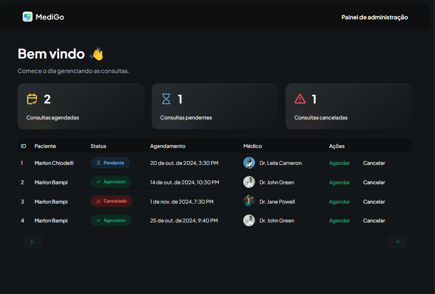
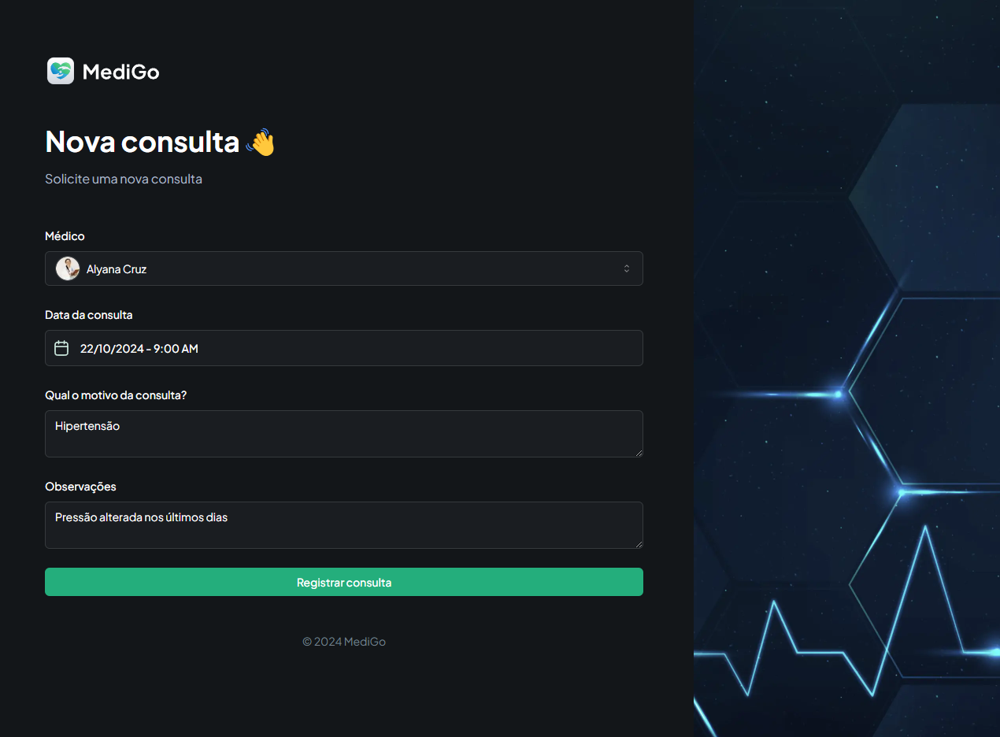

# MediGo

Aplicação para agendamento e gerenciamento de consultas médicas. Usando NextJs e Appwrite para gerenciamento de dados.

## Live

Acesse <http://localhost:5173> para visualizar a aplicação.

## Tech Stack
- React/Nextjs
- react-hook-form
- tailwind
- zod
- sentry
- shadcn
- @tanstack/react-table
- appwrite

## Screenshots

  

  

  

